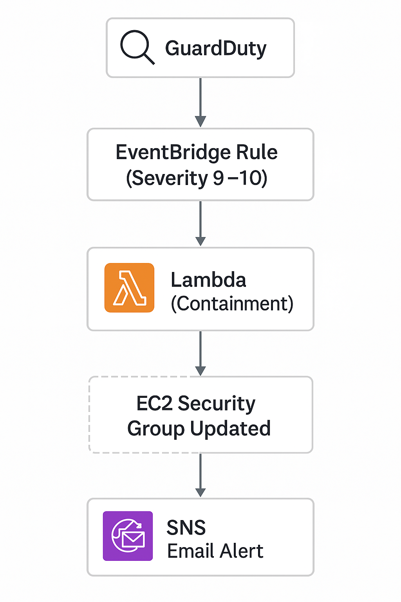
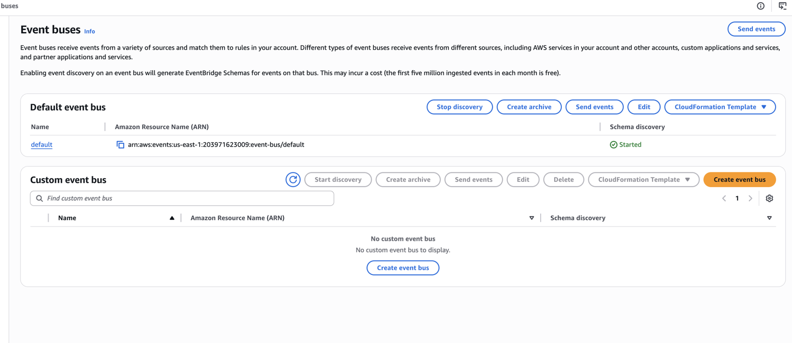
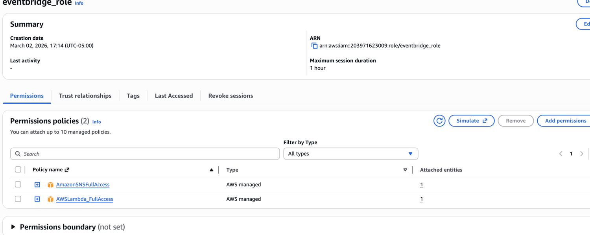
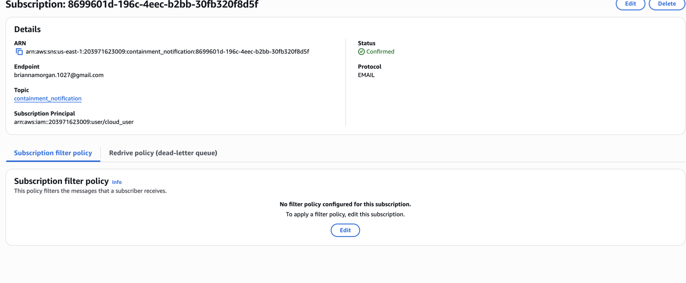
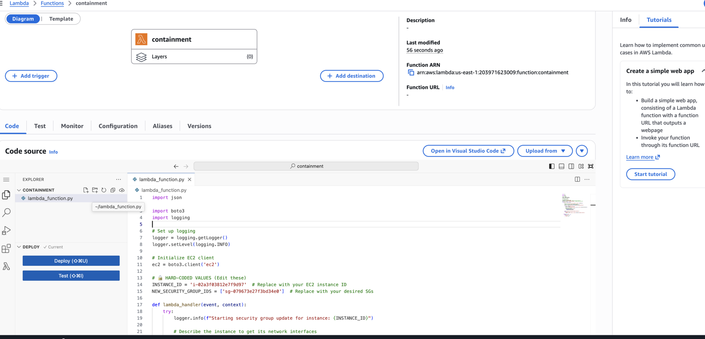
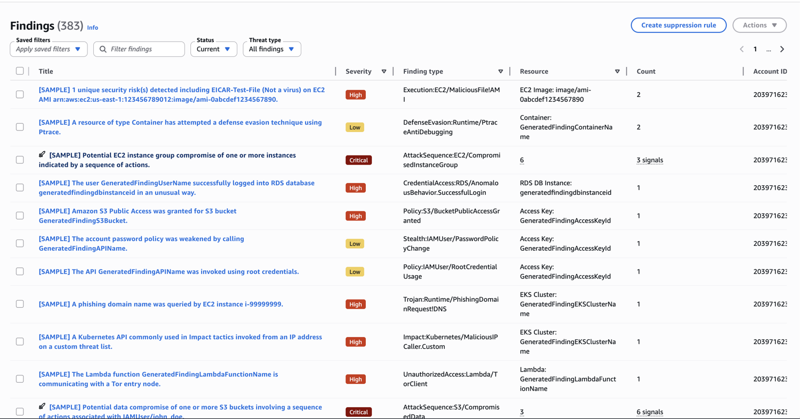

## AWS Live Threat Detection & Automated Response Simulation
This lab demonstrates how to build an automated threat‑detection and containment workflow using Amazon GuardDuty, Amazon EventBridge, AWS Lambda, and Amazon SNS. When GuardDuty generates a critical‑severity finding, EventBridge routes the event to a Lambda function that isolates an EC2 instance by modifying its security groups. At the same time, SNS sends an email notification with details of the triggering event.

This project simulates a real‑world cloud incident response pipeline and showcases automated remediation patterns used by security engineering teams.

## 📌 Architecture Overview

GuardDuty generates or simulates findings, which are received by EventBridge on the default event bus.  
EventBridge applies a rule to filter findings with severity **9.0–10.0**.  
An IAM role allows EventBridge to invoke a Lambda function and publish to SNS.  
The Lambda function updates EC2 security groups to perform containment, and SNS sends an email alert to the responder.

**Flow:**  
**GuardDuty → EventBridge → Lambda + SNS → EC2 isolated + email alert delivered**





## 🚌 EventBridge Default Event Bus




EventBridge schema discovery is enabled on the default event bus so GuardDuty findings can be inspected and matched against your rule.

## 🔐 IAM Role: EventBridge Execution Role




This role allows EventBridge to invoke Lambda and publish to SNS.

### **Trust Policy**

```json
{
  "Version": "2012-10-17",
  "Statement": [
    {
      "Effect": "Allow",
      "Principal": {
        "Service": "events.amazonaws.com"
      },
      "Action": "sts:AssumeRole"
    }
  ]
}
```

Attached Policies

AWSLambda_FullAccess

AmazonSNSFullAccess

## 📨 SNS Topic & Subscription





Topic: containment_notification  
Protocol: Email
Status: Confirmed
Endpoint: Your email address

SNS delivers alerts whenever the EventBridge rule is triggered.

## ⚙️ Lambda Containment Function




The Lambda function isolates the EC2 instance by replacing its security groups with a restrictive “Containment” group.

Key Variables

python
INSTANCE_ID = "i-xxxxxxxxxxxxxxxxx"
NEW_SECURITY_GROUP_IDS = ["sg-xxxxxxxxxxxxxxxxx"]
Behavior

Logs the start of containment

Retrieves the instance’s network interfaces

Applies the Containment security group

## 🎯 EventBridge Rule: Critical GuardDuty Findings




This rule listens for GuardDuty findings with severity 9.0–10.0.


### **Event Pattern**

```json
{
  "source": ["aws.guardduty"],
  "detail-type": ["GuardDuty Finding"],
  "detail": {
    "severity": [
      9,
      9.1,
      9.2,
      9.3,
      9.4,
      9.5,
      9.6,
      9.7,
      9.8,
      9.9,
      10
    ]
  }
}
```

Targets

Lambda function: containment

SNS topic: containment_notification

Execution role: eventbridge_role

## 🛡️ GuardDuty Findings Feed

GuardDuty generates a variety of simulated findings, including:

EC2 malware execution

Container defense evasion

RDS anomalous logins

S3 public access

IAM root credential usage

EKS malicious API calls

Multi‑signal attack sequences (Critical)

Only Critical findings trigger the EventBridge rule.

## 🧪 Lab Steps

**1️⃣ Enable EventBridge Schema Discovery**  
   - Navigate to **EventBridge → Event buses**  
   - Under **Default event bus**, select **Start discovery**

**2️⃣ Enable GuardDuty**  
   - Open **GuardDuty**  
   - Click **Get started → Enable GuardDuty**

**3️⃣ Create an EC2 Instance**  
   - Launch an Ubuntu instance named **Web_Server**  
   - Enable **SSH**, **HTTP**, and **HTTPS**  
   - Ensure **Auto‑Assign Public IP** is enabled  

**4️⃣ Create the Containment Security Group**  
   - **Name:** `Containment`  
   - **Inbound rule:** SSH (22) from Anywhere *(lab only)*  

**5️⃣ Create the Lambda Execution Role**  
   - Create a role for **Lambda**  
   - Attach: `AmazonEC2FullAccess`  
   - **Name:** `Lambda_Role`  

**6️⃣ Create the EventBridge Execution Role**  
   - Create a role with a **Custom trust policy**  
   - Attach:  
     - `AWSLambda_FullAccess`  
     - `AmazonSNSFullAccess`  
   - **Name:** `EventBridge_Role`  

**7️⃣ Create the SNS Topic & Subscription**  
   - **Topic name:** `Containment_Notification`  
   - Create an **email subscription**  
   - Confirm the subscription via email  

**8️⃣ Create the Lambda Function**  
   - **Name:** `Containment`  
   - **Runtime:** Python 3.13  
   - **Execution role:** `Lambda_Role`  
   - Paste the code from `Lambda.py`  
   - Replace:  
     - EC2 **Instance ID**  
     - **Security Group ID**  
   - Deploy the function  

**9️⃣ Create the EventBridge Rule**  
   - **Name:** `Critical_Containment`  
   - Paste JSON from `Event_Pattern_Critical.json`  
   - **Target 1:** Lambda → `containment`  
   - **Target 2:** SNS → `containment_notification`  
   - **Execution role:** `eventbridge_role`  
   - Create the rule and wait **5 minutes**  

**🔟 Trigger GuardDuty Sample Findings
- In GuardDuty → **Settings → Sample findings → Generate sample findings**
- Wait up to **7 minutes**
- EC2 instance security group will update to **Containment**
- You will receive **three SNS email alerts**


## 🏁 Outcome
This project demonstrates:

Real‑time detection of critical cloud threats

Automated containment of compromised EC2 instances

Immediate alerting to security responders

A fully event‑driven incident response pipeline using AWS native services

This lab showcases practical cloud security engineering and incident response skills suitable for senior‑level cloud security, detection engineering, and IR roles.
